# Cloud Projects - GitHub CI/CD Pipeline Showcase

A production-ready CI/CD (Continuous Integration and Continuous Deployment) pipeline scaffolded inside a modern React (Vite) + TypeScript application. This project features a built-in **interactive pipeline simulator** as a visual front-end dashboard, deploying seamlessly to **GitHub Pages** using GitHub Actions.

## Pipeline Architecture

The workflow below illustrates the automatic triggers and steps defined for both the CI (Pull Request validation) and CD (Deploying to Main) pipelines.

```mermaid
graph TD
    Developer([Developer]) -->|Push / Pull Request| GitHub[GitHub Repository]
    
    subgraph CI_Pipeline [CI Workflow - Pull Request / Branch Push]
        PR_Trigger[PR to main / Push to branch] --> CI_Runner[ubuntu-latest runner]
        CI_Runner --> Checkout_CI[Checkout Code]
        Checkout_CI --> Setup_Node_CI[Set up Node.js v20]
        Setup_Node_CI --> Install_CI[npm ci]
        Install_CI --> Format_CI[Prettier Check]
        Format_CI --> Lint_CI[ESLint Lint]
        Lint_CI --> Test_CI[Vitest Unit Tests]
        Test_CI --> Build_CI[Vite Production Build]
        Build_CI --> Complete_CI([CI Status: Success])
    end
    
    subgraph CD_Pipeline [CD Workflow - Push to Main]
        Push_Trigger[Push/Merge to main] --> CD_Runner[ubuntu-latest runner]
        CD_Runner --> Checkout_CD[Checkout Code]
        Checkout_CD --> Setup_Node_CD[Set up Node.js v20]
        Setup_Node_CD --> Install_CD[npm ci]
        Install_CD --> Verify_CD[Format, Lint & Test]
        Verify_CD --> Build_CD[Vite Production Build]
        Build_CD --> Deploy_CD[Deploy to GitHub Pages]
        Deploy_CD --> Complete_CD([Site Updated Live])
    end
    
    GitHub --> CI_Pipeline
    GitHub --> CD_Pipeline
```



---

## Project Structure

The project has the following directory structure:

```text
Cloud Projects/
├── .github/
│   └── workflows/
│       ├── ci.yml            # CI validation workflow (format, lint, test, compile)
│       └── cd.yml            # CD deployment workflow (verification + deployment)
├── src/
│   ├── test/
│   │   └── setup.ts          # Vitest testing environment setup
│   ├── App.tsx               # Main Dashboard application (Pipeline Simulator)
│   ├── App.test.tsx          # Vitest Unit Tests
│   ├── index.css             # Vanilla CSS Custom Design System
│   ├── main.tsx              # React bootstrap script
│   └── vite-env.d.ts         # TypeScript environment declarations
├── .gitignore                # Node.js specific ignore file
├── .prettierrc               # Prettier format rules
├── eslint.config.js          # ESLint flat config file
├── index.html                # Main entry HTML template
├── package.json              # Script directives & dependencies
├── tsconfig.json             # TS compiler configuration
└── vite.config.ts            # Vite & Vitest configuration
```

---

## Pipeline Workflow Details

### 1. Continuous Integration (CI) — `ci.yml`
* **Trigger**: Triggers on pull requests to the `main` branch or pushes to feature/development branches (ignoring `main`).
* **Environment**: Runs on `ubuntu-latest`.
* **Steps**:
  1. **Checkout**: Checks out the repository files.
  2. **Set up Node.js**: Installs Node v20 and configures package-level caching for fast npm installs.
  3. **Install Dependencies**: Runs `npm ci` to cleanly install dependencies from `package-lock.json`.
  4. **Prettier Format Check**: Runs `npm run format:check` to verify that all code matches styling guidelines.
  5. **ESLint Lint**: Runs `npm run lint` with a strict `max-warnings 0` rule to prevent static analysis errors.
  6. **Unit Testing**: Runs Vitest test suites using `npm run test`.
  7. **Build Compilation**: Compiles code using `tsc` and Vite to guarantee zero-defect deployment packaging.

### 2. Continuous Deployment (CD) — `cd.yml`
* **Trigger**: Triggers on merges or direct pushes to the `main` branch.
* **Environment**: Runs on `ubuntu-latest`.
* **Steps**:
  * Inherits all verification checks (install, lint, test, build).
  * **GitHub Pages Deploy**: Utilizes the standard `JamesIves/github-pages-deploy-action@v4` to publish the built directory `Cloud Projects/dist` directly to the `gh-pages` branch of the hosting repository.

---

## Local Development & Installation

Ensure you have [Node.js (v18+)](https://nodejs.org) installed on your system.

1. **Install Dependencies**:
   ```bash
   npm install
   ```

2. **Run Local Server**:
   ```bash
   npm run dev
   ```
   *Starts the app on `http://localhost:5173/`.*

3. **Run Code Formatter**:
   ```bash
   npm run format
   ```

4. **Run Linter**:
   ```bash
   npm run lint
   ```

5. **Run Unit Tests**:
   ```bash
   npm run test
   ```

6. **Create Build Bundle**:
   ```bash
   npm run build
   ```

---

## Step-by-Step GitHub Setup Instructions

Follow these steps to deploy your repository and pipeline live to GitHub:

### Step 1: Create a GitHub Repository
1. Log in to [GitHub](https://github.com).
2. Create a new repository (do not add a README or `.gitignore` since they are already configured in this folder).

### Step 2: Initialize Git and Push to GitHub
Open your terminal in the workspace root and run the following command sequence:

```bash
# Move to the project folder
cd "Cloud Projects"

# Initialize local git repository
git init

# Add all files
git add .

# Create initial commit
git commit -m "feat: init vite react app with GitHub Actions CI/CD"

# Rename default branch to main
git branch -M main

# Link your local repository to your remote GitHub repository
git remote add origin https://github.com/<YOUR-USERNAME>/<YOUR-REPO-NAME>.git

# Push changes to the main branch
git push -u origin main
```

### Step 3: Configure GitHub Pages Settings
1. On your GitHub repository page, navigate to **Settings** > **Pages** (in the sidebar).
2. Under **Build and deployment** > **Source**, verify it is set to **Deploy from a branch**.
3. Under **Branch**, select **`gh-pages`** and folder **`/ (root)`**.
4. Click **Save**.
5. Once the GitHub Actions deploy job completes, your live dashboard link will be displayed at the top of the Pages section!

### Step 4: Test a Feature Pull Request
To see the CI pipeline in action, create a new branch:
```bash
git checkout -b feature/new-component
# (Make some code edits)
git add .
git commit -m "feat: added new component"
git push origin feature/new-component
```
Create a Pull Request in GitHub, and you'll see the **Lint, Test, and Build** validation checks run automatically!
